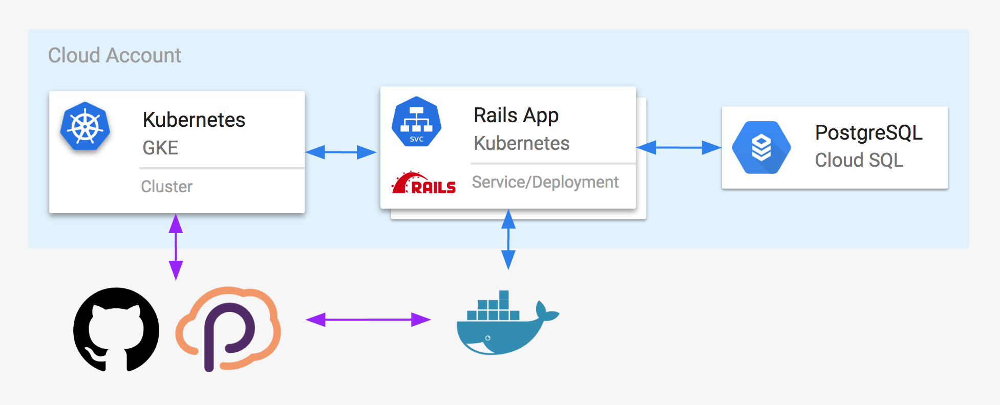

# Ruby on Rails App with GitHub Actions and Pulumi ⚡️

A simple Ruby on Rails App, deployed to Kubernetes using GitHub Actions and Pulumi! ☁️

This leverages Pulumi's GitHub Actions support for deploying any cloud application and infrastructure to
your cloud of choice. In this particular example, we're deploying to Google Cloud Platform, but it supports
AWS, Azure, and even on-premises too. Read more on
[pulumi.io's GitHub Actions Getting Started page](https://pulumi.io/github).

This architecture includes the following major components

* A [fully managed Kubernetes cluster](https://github.com/pulumi/actions-example-gke-rails/blob/master/infra/cluster.ts), running in Google's GKE
* A [managed PostgreSQL database](https://github.com/pulumi/actions-example-gke-rails/blob/master/infra/db.ts), using Google's CloudSQL
* A [fully Dockerize Ruby on Rails application](https://github.com/pulumi/actions-example-gke-rails/blob/master/app)
* A [Docker build-and-publish step](https://github.com/pulumi/actions-example-gke-rails/blob/master/infra/index.ts#L11), to the Docker hub, of the Ruby on Rails application
* A [Kubernetes Deployment and Service](https://github.com/pulumi/actions-example-gke-rails/blob/master/infra/index.ts#L24) definition for this application

## Running the Example

To use this, simply perform these steps:

1. Make a copy of this repo (while GitHub Actions are in private beta, [it must be private](https://gist.github.com/jacquesd/85097472043b697ab57ba1b1c7530274)).
2. Register for Pulumi, and download the CLI.
3. Run `pulumi stack init` to create a new stack which we'll deploy into, and then [configure it](https://pulumi.io/quickstart/gcp/setup.html).
4. Configure your `PULUMI_ACCESS_TOKEN` and `GOOGLE_CREDENTIALS`, per [the instructions over on pulumi.io](https://pulumi.io/github).

Commit or open a PR, and watch GitHub Actions plus Pulumi work its magic! ✨
